# فصل سوم تجزیه و تحلیل داده‌ها

## ۱-۳ مقدمه

در این فصل، پیاده‌سازی رمزنگاری همومورفیک جمعی Paillier برای دو ویژگی عددی از رکوردهای فرضی بیماران بررسی می‌شود. هدف، سنجش صحت بازیابی مقادیر و هزینه زمانی رمزگذاری، رمزگشایی و محاسبه مجموع در فضای رمزشده است. داده‌ها برای ارزیابی نرم‌افزار تولید شده‌اند و بیانگر یک جمعیت بالینی واقعی نیستند. پس از معرفی معماری، روش تولید داده و محیط اجرا، طراحی آزمایش و نتایج اندازه‌گیری ارائه می‌شود. کدهای اجرایی در پیوست الف و فایل‌های پروژه قرار دارند.

## ۲-۳ معماری راه‌حل

معماری شامل منبع داده، مؤلفه رمزگذاری و مؤلفه بازیابی مجاز است. در نمونه اجرایی، رکوردهای فرضی از فایل CSV خوانده و در پایگاه‌داده SQLite ذخیره می‌شوند. دو ستون عددی blood_test_result و tumor_marker با کلید عمومی رمزگذاری می‌شوند. متن رمز، نمای عددی و مقیاس بازنمایی برای بازیابی نگهداری می‌شوند. سایر ستون‌ها در نمونه نمایشی به صورت متن‌ساده کپی می‌شوند؛ این انتخاب برای نمایش جریان پردازش است و حفاظت کامل از یک پرونده پزشکی را فراهم نمی‌کند.

کلید خصوصی در نسخه حاضر فقط در حافظه همان اجرای برنامه تولید و استفاده می‌شود و در فایل ذخیره نمی‌شود. بنابراین نمونه نمایشی، مراحل رمزگذاری و رمزگشایی را در یک نشست اجرا می‌کند. امکان بازیابی در اجرای مستقل بعدی به مدیریت کلید پایدار نیاز دارد و در این نسخه پیاده‌سازی نشده است. فایل‌های خروجی متن‌ساده نمونه نمایشی تنها برای بررسی صحت تولید می‌شوند و برای داده‌های واقعی نیازمند سیاست دسترسی و نگهداری هستند.

## ۳-۳ مبنای انتخاب Paillier

نیاز اصلی این آزمایش، حفظ مقادیر عددی و محاسبه مجموع بدون رمزگشایی رکوردهای منفرد است. Paillier از جمع مقادیر رمزشده و ضرب مقدار رمزشده در عدد آشکار پشتیبانی می‌کند [۱۴]. این قابلیت برای محاسبه مجموع دو ویژگی و سپس میانگین آن‌ها مناسب است. میانگین در این پیاده‌سازی پس از رمزگشایی مجموع و با استفاده از تعداد رکوردها محاسبه می‌شود.

رمزنگاری، گمنام‌سازی و افزودن نویز اهداف یکسانی ندارند. رمزنگاری به محدودکردن دسترسی به مقدار کمک می‌کند؛ گمنام‌سازی خطر پیوند رکورد به شخص را کاهش می‌دهد و سازوکارهای حریم خصوصی تفاضلی افشای اطلاعات از خروجی‌های آماری را کنترل می‌کنند. بنابراین انتخاب Paillier در این پژوهش به نیاز مشخص محاسبه تجمیعی مربوط است و برتری عمومی آن نسبت به روش‌های دیگر را اثبات نمی‌کند. هیچ پیاده‌سازی مقایسه‌ای از روش‌های دیگر در آزمایش‌های این فصل اجرا نشده است.

## ۴-۳ تولید داده‌های فرضی

مجموعه‌داده شامل ۵۰۰۰ رکورد است که با برنامه پایتون و بذر ثابت 20261005 تولید شده‌اند. هر رکورد دارای شناسه، نام ساختگی، سن، جنسیت، نوع و مرحله فرضی سرطان، درمان فرضی، تاریخ فرضی تشخیص، وضعیت فرضی متاستاز و دو ویژگی عددی است. نام‌ها به صورت Synthetic و یک شماره یکتا ساخته شده‌اند و به افراد واقعی اشاره ندارند.

سن از اعداد صحیح ۱۸ تا ۹۰ انتخاب می‌شود. ویژگی عددی اول در بازه ۱ تا ۲۰ و ویژگی عددی دوم در بازه ۱ تا ۱۰۰۰، با دو رقم اعشار، تولید می‌شود. این دو ویژگی نماینده یک آزمایش پزشکی مشخص نیستند و واحد بالینی به آن‌ها نسبت داده نشده است. ویژگی‌های دسته‌ای به صورت تصادفی و مستقل انتخاب می‌شوند. ازاین‌رو، سازگاری نوع سرطان با جنسیت یا روابط مرحله بیماری، درمان و نشانگرها تضمین نشده است. این محدودیت مانع آزمون عملیات عددی نیست، ولی استفاده از داده‌ها برای استنباط بالینی را ناموجه می‌کند.

زیرمجموعه‌های آزمایش از ۱۰۰، ۱۰۰۰ و ۵۰۰۰ رکورد نخست همان فایل انتخاب شده‌اند. ثابت‌بودن نمونه‌ها و انتشار برنامه تولید، بذر و هش فایل، بررسی ورودی آزمایش را ممکن می‌کند. تصادفی‌بودن کلید و رمزگذاری سبب می‌شود متن‌های رمز در اجرای بعدی یکسان نباشند؛ انتظار بازتولید به روش، صحت و روند عملکرد مربوط است و به معنی تکرار دقیق زمان‌ها نیست.

## ۵-۳ بازنمایی عددی و روابط الگوریتم

برای دو ویژگی دارای دو رقم اعشار، مقدار اصلی x با محاسبات Decimal به عدد صحیح m = 100x تبدیل می‌شود. در این مجموعه‌داده m همواره صحیح است. هنگام بازیابی، مقدار رمزگشایی‌شده بر ۱۰۰ تقسیم می‌شود. در مقایسه با ذخیره مستقیم عدد اعشاری، این بازنمایی بررسی دقیق برابری و جمع را ساده می‌کند. این روش برای داده‌ای با بیش از دو رقم اعشار به همان شکل قابل استفاده نیست و به انتخاب مقیاس مناسب نیاز دارد.

در Paillier، با انتخاب دو عدد اول p و q، مقدار n = pq ساخته می‌شود. کلید عمومی شامل n و g است. برای پیام صحیح m در دامنه مجاز و عدد تصادفی r نسبت‌اول با n، متن رمز از رابطه c = g^m r^n mod n² به دست می‌آید. با تعریف L(u) = (u−1)/n و پارامترهای خصوصی λ و μ، رمزگشایی از رابطه m = L(c^λ mod n²) μ mod n انجام می‌شود. خاصیت جمعی از رابطه D(E(m₁)E(m₂) mod n²) = (m₁+m₂) mod n نتیجه می‌شود [۱۴].

در پیاده‌سازی، مجموع مقادیر باید در دامنه بازنمایی مجاز کتابخانه قرار گیرد. مقادیر و تعداد رکوردهای آزمایش حاضر نسبت به دامنه کلیدها کوچک‌اند. صحت بازیابی هر دو مجموع در هر تکرار بررسی شده است. نمای EncryptedNumber برای اعداد صحیح این نسخه صفر است و مقیاس ثابت ۱۰۰ جداگانه حفظ می‌شود.

## ۶-۳ محیط اجرا

اندازه‌گیری‌های این فصل در یک محیط اجرای Linux میزبانی‌شده انجام شده‌اند. اجرای مرجع به رایانه شخصی پژوهشگر نسبت داده نمی‌شود. اطلاعات سیستم، نسخه زبان و وابستگی‌ها همراه با نتایج ثبت شده‌اند. منابع گزارش‌شده، منابع قابل مشاهده محیط مجازی هستند و به معنی اختصاص سخت‌افزار فیزیکی کامل به آزمایش نیستند.

| مشخصه | مقدار |
|---|---|
| محل اجرا | محیط Linux میزبانی‌شده |
| سیستم‌عامل | Linux-6.18.44-x86_64-with-glibc2.39 |
| پردازنده قابل مشاهده | AMD EPYC 9V74 80-Core Processor |
| تعداد پردازنده منطقی قابل مشاهده | 9 |
| حافظه قابل مشاهده | 9.73 GiB |
| Python | 3.12.14 |
| phe | 1.5.0 |
| gmpy2 | 2.3.2 |
| بذر داده | 20261005 |
| تعداد تکرار هر حالت | ۳ |

برای محاسبات اعداد بزرگ از gmpy2 استفاده شده است. پشتیبانی اختیاری از این وابستگی در python-paillier وجود دارد [۱۵، ۱۶]. بنابراین زمان‌ها را نباید با یک اجرای پایتون بدون این شتاب‌دهنده، بدون ذکر تفاوت محیط، مقایسه کرد. اندازه‌گیری حافظه فرایند در محیط حاضر در دسترس نبود و ادعایی درباره بیشینه مصرف حافظه ارائه نمی‌شود.

## ۷-۳ فرایند رمزگذاری و ذخیره‌سازی

در برنامه نمایشی، رکوردها در جدول اصلی SQLite ذخیره می‌شوند. برای هر رکورد، دو مقدار عددی به مقیاس صحیح تبدیل و با کلید عمومی رمزگذاری می‌شوند. خروجی رمزگذاری به صورت رشته عددی ذخیره می‌شود، زیرا مقدار متن رمز از دامنه عدد صحیح متعارف SQLite بزرگ‌تر است. شناسه رکورد، نمای عددی و مقیاس بازنمایی نیز حفظ می‌شوند.

کد اجرایی این جریان در پیوست الف، بخش الف-۲، و فایل src/demo.py آمده است. برنامه اندازه‌گیری در پیوست الف، بخش الف-۱، جداگانه زمان عملیات رمزنگاری و زمان نوشتن پایگاه‌داده را ثبت می‌کند. در آزمایش زمان‌سنجی، پایگاه‌داده موقت فقط شناسه، شماره ویژگی، متن رمز و نمای عددی را نگهداری می‌کند؛ حجم گزارش‌شده مربوط به همین جدول عددی است و اندازه کل پرونده بیمار نیست.

## ۸-۳ رمزگشایی و بررسی صحت

متن‌های رمز از SQLite خوانده می‌شوند و با کلید عمومی و نمای ذخیره‌شده به شیء EncryptedNumber بازسازی می‌شوند. کلید خصوصی برای بازیابی اعداد صحیح مقیاس‌شده استفاده می‌شود. هر مقدار بازیابی‌شده با مقدار ورودی متناظر مقایسه می‌شود. معیارهای صحت شامل درصد تطابق دقیق و بیشینه اختلاف مطلق در واحد اولیه داده‌اند.

در نمونه نمایشی، مقادیر بازیابی‌شده در فایل recovered.csv قرار می‌گیرند. این خروجی برای بررسی اجرای نمونه است و با داده بالینی واقعی نباید به صورت عمومی منتشر شود. در بسته حاضر تنها داده‌های ساختگی منتشر می‌شوند و کلید خصوصی ذخیره یا منتشر نمی‌شود.

## ۹-۳ محاسبات تجمیعی همومورفیک

برای هر ستون، متن‌های رمز با عملگر جمع کتابخانه ترکیب می‌شوند. در پایان فقط دو مجموع رمزگشایی می‌شوند و میانگین از تقسیم مجموع بازیابی‌شده بر تعداد رکوردها محاسبه می‌شود. صحت مجموع‌ها با جمع اعداد صحیح ورودی بررسی می‌شود. پیش از اشتراک احتمالی متن رمز مجموع، مبهم‌سازی تصادفی خروجی اعمال می‌شود [۱۴].

زمان مسیر تجمیعی شامل جمع هر دو ستون و رمزگشایی دو مجموع نهایی است. این مسیر با زمان رمزگشایی جداگانه همه مقادیر مقایسه شده است. هزینه رمزگذاری اولیه و ورود و خروج داده در این نسبت منظور نمی‌شود، زیرا مقایسه به دو راه استخراج مجموع از داده‌ای مربوط است که قبلاً رمزگذاری شده است. مجموع‌های منتشرشده، به‌ویژه برای گروه‌های کوچک یا پرس‌وجوهای تکراری، همچنان می‌توانند اطلاعات آشکار کنند؛ جمع همومورفیک به‌تنهایی کنترل افشای خروجی را تضمین نمی‌کند.

## ۱۰-۳ طراحی آزمایش و دلیل انتخاب اندازه نمونه

۱۰۰ رکورد برای آزمون اولیه مسیر پردازش انتخاب شده است تا خطاهای قالب داده، بازنمایی عددی و ذخیره‌سازی با هزینه اجرای محدود آشکار شوند. این عدد مبنای اثبات مقیاس‌پذیری یا نمایندگی یک جمعیت پزشکی نیست. ارزیابی اصلی با ۱۰۰۰ و ۵۰۰۰ رکورد انجام شده تا عملکرد در دو مقیاس بزرگ‌تر بررسی شود. تعدادها انتخاب عملی برای آزمون نرم‌افزار هستند و از محاسبه حجم نمونه آماری بالینی حاصل نشده‌اند.

هر اندازه نمونه با طول کلیدهای ۱۰۲۴ و ۲۰۴۸ بیت و در سه تکرار مستقل آزمایش شده است. در هر تکرار یک زوج کلید جدید تولید می‌شود و پیش از زمان‌سنجی اصلی، ده مقدار برای گرم‌کردن مسیر اجرا پردازش می‌شوند. طول کلید ۱۰۲۴ صرفاً برای مشاهده تفاوت هزینه محاسباتی وارد آزمایش شده است و توصیه استفاده عملیاتی محسوب نمی‌شود. این مطالعه کفایت امنیتی طول کلید ۲۰۴۸ برای هر کاربرد واقعی را نیز ارزیابی نکرده است.

زمان‌ها با perf_counter اندازه‌گیری شده‌اند. رمزگذاری و رمزگشایی دو ویژگی برای هر رکورد، سریالی و در یک فرایند انجام می‌شود. زمان تولید کلید، سریال‌سازی متن رمز، نوشتن SQLite، خواندن و بازسازی، و محاسبات تجمیعی جداگانه ثبت شده‌اند. همه تکرارها در فایل benchmark_raw.csv نگهداری می‌شوند؛ جدول‌های فصل میانگین و انحراف معیار نمونه‌ای سه تکرار را گزارش می‌کنند. انحراف معیار توصیف پراکندگی این اجراهاست و فاصله اطمینان یا تضمین زمان اجرای آینده نیست.

## ۱۱-۳ دسترسی به کد و داده‌ها

کدهای اجرایی، وابستگی‌های نسخه‌بندی‌شده، مجموعه‌داده CSV، روش تولید و خروجی خام آزمایش در بسته همراه این پژوهش قرار دارند. فایل README ترتیب نصب و اجرای برنامه را شرح می‌دهد. ثبت شناسه commit مخزن منتشرشده، نسخه کد استفاده‌شده در پایان‌نامه را مشخص می‌کند.

نشانی مخزن کد و شناسه نسخه پس از انتشار در گیت‌هاب درج می‌شود.

نشانی مستقیم فایل داده پس از انتشار در گیت‌هاب درج می‌شود.

## ۱۲-۳ تحلیل امنیت و دامنه حفاظت

دو ویژگی عددی در برابر مشاهده مستقیم متن‌ساده در پایگاه‌داده رمزگذاری‌شده حفاظت می‌شوند، مشروط بر محرمانه‌ماندن کلید خصوصی و استفاده درست از الگوریتم و تصادفی‌سازی. این آزمایش آزمون نفوذ یا اثبات امنیت کتابخانه نیست. Paillier پایه امکان تغییرپذیری متن رمز را دارد و پیاده‌سازی حاضر احراز اصالت داده، حفاظت در برابر مهاجم فعال یا حمله متن رمز منتخب را فراهم نمی‌کند.

در نمونه نمایشی، نام و سایر ویژگی‌های سلامت رمزگذاری نشده‌اند. نام یک شناسه مستقیم است و تاریخ، سن و ویژگی‌های بیماری نیز ممکن است در شناسایی یا افشای اطلاعات نقش داشته باشند. بنابراین عنوان پایگاه‌داده رمزگذاری‌شده نباید به حفاظت کامل همه ستون‌ها تعبیر شود. نسخه عملیاتی به کنترل دسترسی، حفاظت از منبع متن‌ساده، مدیریت چرخه عمر کلید و کنترل انتشار نتایج نیاز دارد.

## ۱۳-۳ نتایج عملکرد و نمودارها

در مجموع ۱۸ اجرای اندازه‌گیری، تطابق دقیق تمام مقادیر عددی مقیاس‌شده و هر دو مجموع برابر ۱۰۰ درصد بود و بیشینه اختلاف مطلق صفر ثبت شد. برای ۵۰۰۰ رکورد و کلید ۲۰۴۸ بیت، زمان رمزگذاری دو ویژگی به طور میانگین 94.966 ثانیه و زمان رمزگشایی همه مقادیر 27.295 ثانیه بود. مسیر جمع دو ستون و رمزگشایی دو نتیجه نهایی 0.1131 ثانیه زمان برد. این نتیجه به همین داده‌ها، همین بازنمایی عددی و محیط ثبت‌شده محدود است.

جدول ۱-۳ زمان‌های اصلی را برحسب ثانیه و به صورت میانگین ± انحراف معیار نشان می‌دهد. هر ردیف مربوط به سه تکرار است و هر رکورد دو مقدار عددی دارد.

| رکورد | طول کلید بیت | تولید کلید | رمزگذاری | رمزگشایی کامل | مسیر تجمیعی |
|---|---|---|---|---|---|
| 100 | 1024 | 0.0029 ± 0.0006 | 0.2885 ± 0.0113 | 0.0879 ± 0.0029 | 0.0043 ± 0.0001 |
| 100 | 2048 | 0.0402 ± 0.0057 | 1.8945 ± 0.0086 | 0.5424 ± 0.0117 | 0.0258 ± 0.0010 |
| 1000 | 1024 | 0.0038 ± 0.0008 | 2.7953 ± 0.0366 | 0.8412 ± 0.0295 | 0.0116 ± 0.0010 |
| 1000 | 2048 | 0.0369 ± 0.0117 | 19.0504 ± 0.1217 | 5.4274 ± 0.1445 | 0.0396 ± 0.0005 |
| 5000 | 1024 | 0.0041 ± 0.0019 | 13.7545 ± 0.2971 | 4.1483 ± 0.1256 | 0.0423 ± 0.0011 |
| 5000 | 2048 | 0.0253 ± 0.0038 | 94.9656 ± 0.6507 | 27.2947 ± 0.4255 | 0.1131 ± 0.0078 |

جدول ۲-۳ حجم جدول عددی رمزشده و معیارهای صحت را ارائه می‌کند. اندازه SQLite شامل ساختار ذخیره‌سازی آن است و نسبت به اندازه خام یک عدد رمزگذاری‌شده تفاوت دارد.

| رکورد | طول کلید بیت | حجم MiB | تطابق درصد | خطای فردی | خطای مجموع |
|---|---|---|---|---|---|
| 100 | 1024 | 0.145 | 100 | 0 | 0 |
| 100 | 2048 | 0.273 | 100 | 0 | 0 |
| 1000 | 1024 | 1.340 | 100 | 0 | 0 |
| 1000 | 2048 | 2.648 | 100 | 0 | 0 |
| 5000 | 1024 | 6.660 | 100 | 0 | 0 |
| 5000 | 2048 | 13.188 | 100 | 0 | 0 |

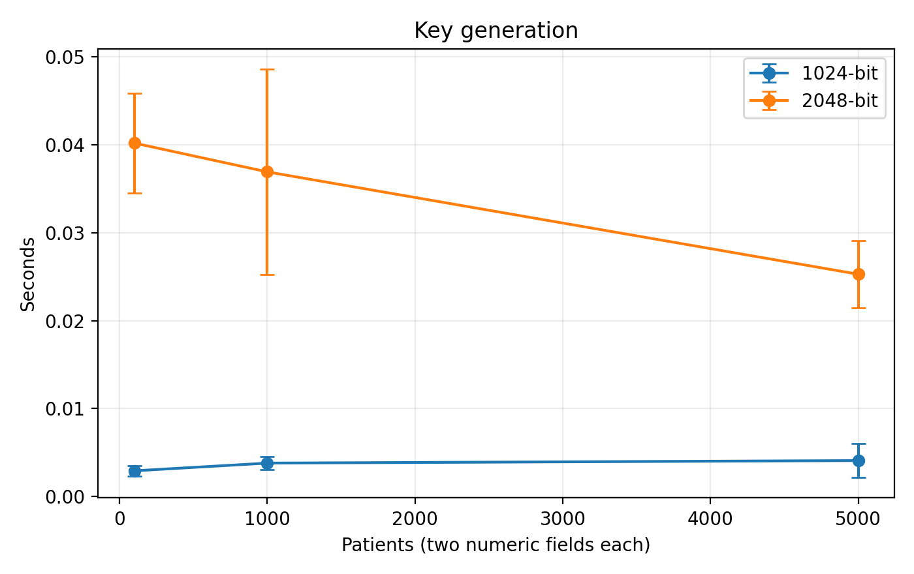

نمودار 1-۳ زمان تولید کلید. میله‌های خطا، انحراف معیار سه تکرار هستند.

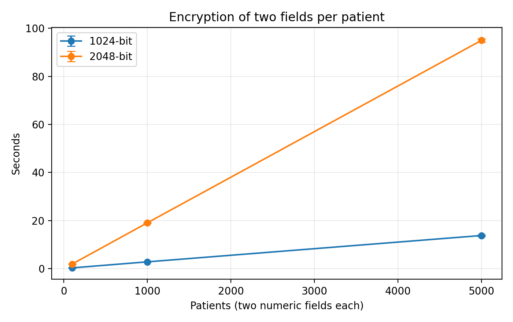

نمودار 2-۳ زمان رمزگذاری دو ویژگی برای هر بیمار. میله‌های خطا، انحراف معیار سه تکرار هستند.

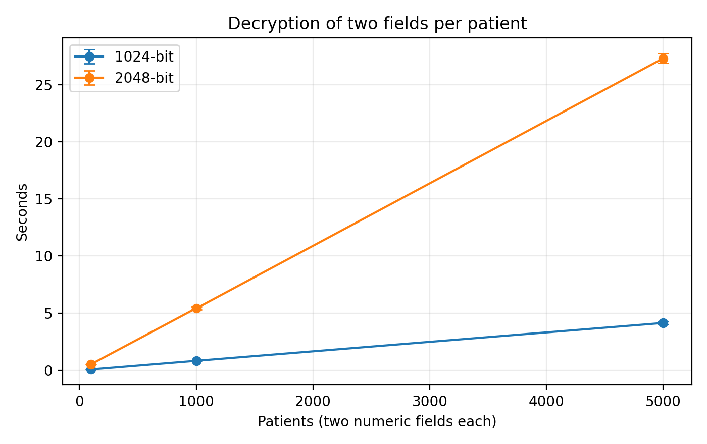

نمودار 3-۳ زمان رمزگشایی دو ویژگی برای هر بیمار. میله‌های خطا، انحراف معیار سه تکرار هستند.

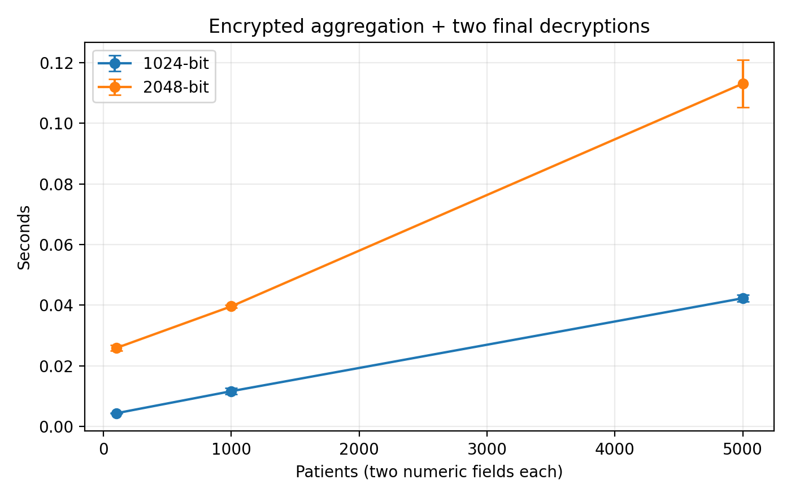

نمودار 4-۳ زمان جمع دو ستون و رمزگشایی مجموع‌ها. میله‌های خطا، انحراف معیار سه تکرار هستند.

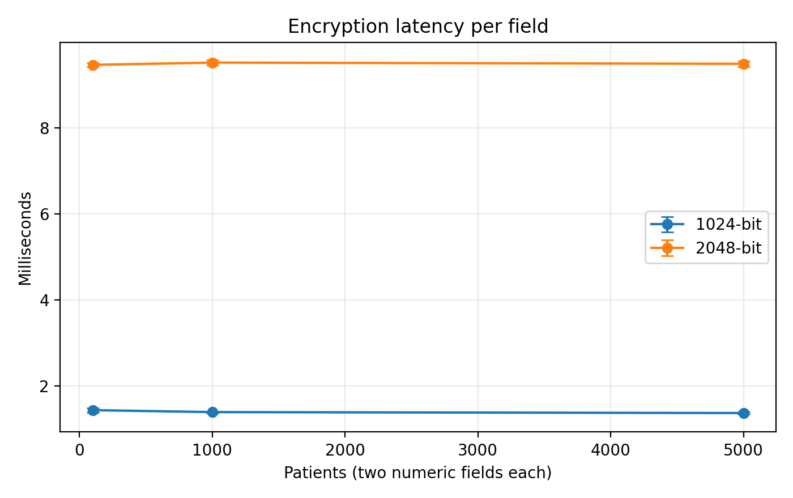

نمودار 5-۳ زمان رمزگذاری هر ویژگی. میله‌های خطا، انحراف معیار سه تکرار هستند.

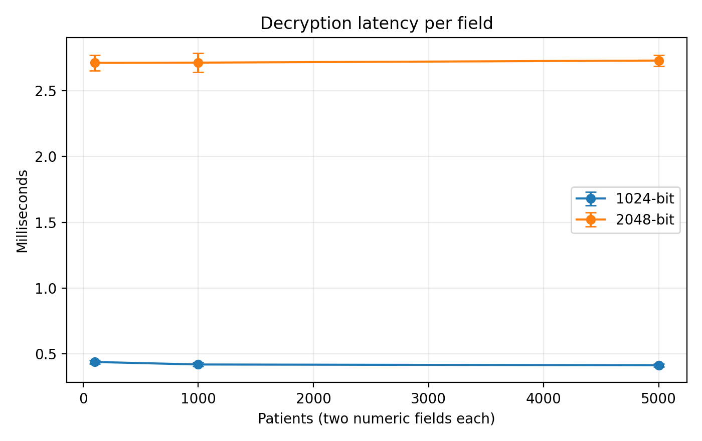

نمودار 6-۳ زمان رمزگشایی هر ویژگی. میله‌های خطا، انحراف معیار سه تکرار هستند.

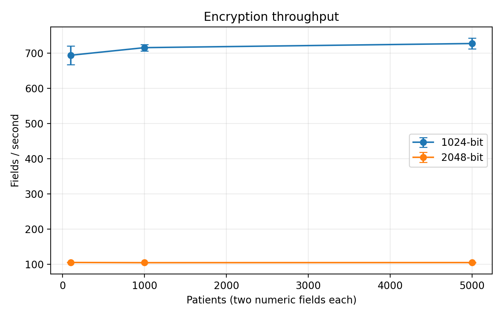

نمودار 7-۳ نرخ پردازش رمزگذاری. میله‌های خطا، انحراف معیار سه تکرار هستند.

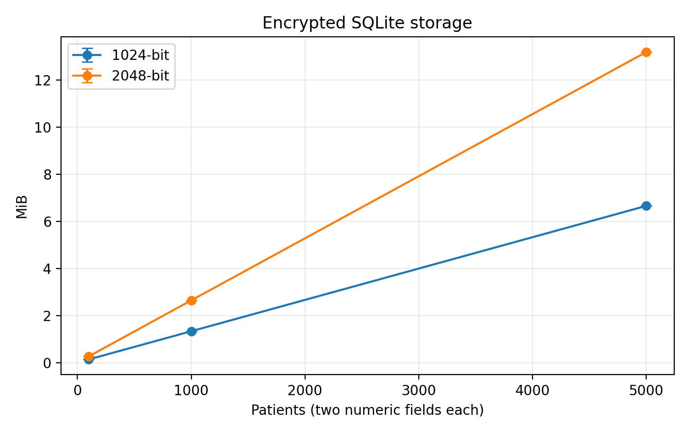

نمودار 8-۳ حجم جدول عددی SQLite رمزشده. میله‌های خطا، انحراف معیار سه تکرار هستند.

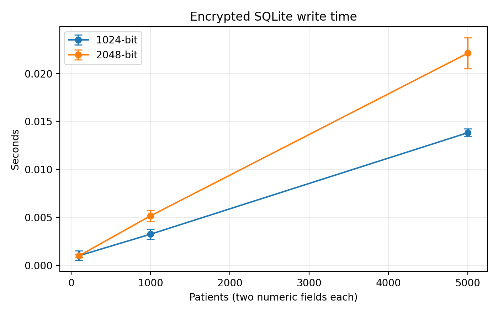

نمودار 9-۳ زمان نوشتن جدول رمزشده در SQLite. میله‌های خطا، انحراف معیار سه تکرار هستند.

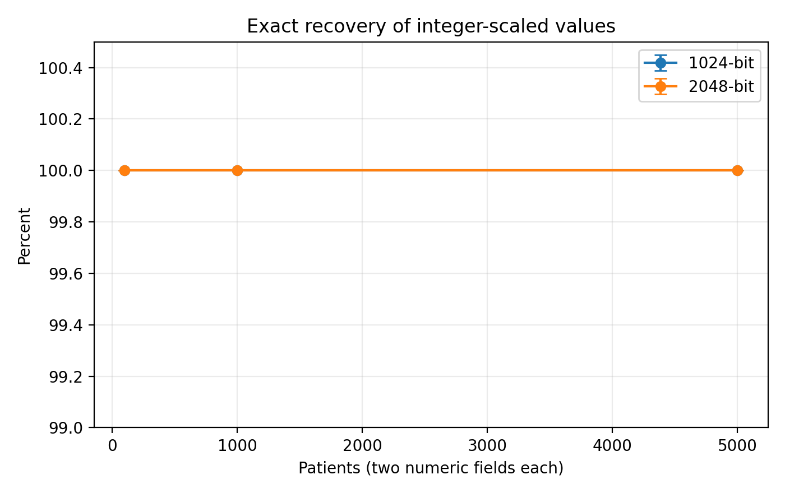

نمودار 10-۳ درصد بازیابی دقیق اعداد مقیاس‌شده. میله‌های خطا، انحراف معیار سه تکرار هستند.

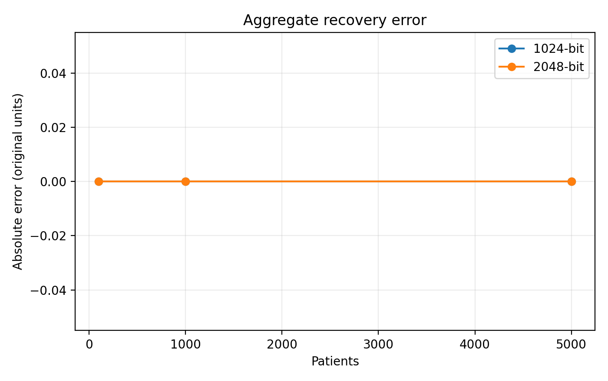

نمودار 11-۳ بیشینه خطای مطلق مجموع‌های بازیابی‌شده. خطای مجموع‌ها در تمام حالت‌ها صفر بود.

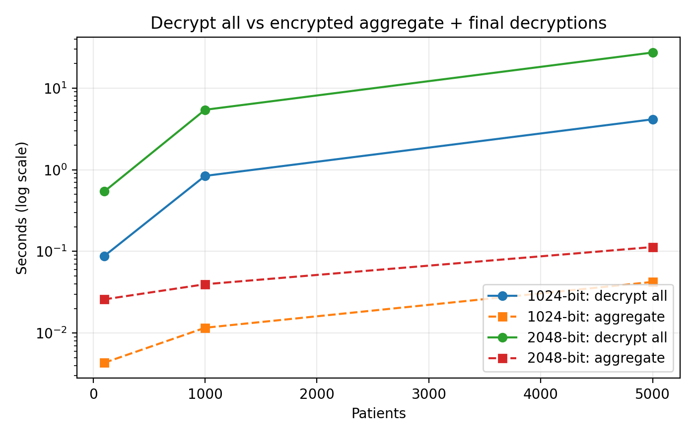

نمودار 12-۳ مقایسه رمزگشایی کامل با مسیر تجمیعی. محور عمودی لگاریتمی است؛ مسیر تجمیعی شامل رمزگشایی دو مجموع نهایی است.

## ۱۴-۳ محدودیت‌های ارزیابی

داده‌ها کاملاً فرضی و فاقد اعتبارسنجی بالینی‌اند. ویژگی‌ها مستقل تولید شده‌اند و مجموعه‌داده، تنوع و روابط پیچیده پرونده‌های واقعی را نشان نمی‌دهد. نتایج به دو ویژگی عددی دارای دو رقم اعشار، همین کتابخانه و همین محیط اجرای میزبانی‌شده محدودند. اندازه‌های آزمایش، عملکرد در میلیون‌ها رکورد یا سرویس هم‌زمان چندکاربره را اثبات نمی‌کنند.

منابع محیط مشترک‌اند و ممکن است بار محیط بر زمان‌ها اثر بگذارد. تنها سه تکرار برای هر حالت انجام شده است. آزمون حافظه، تأخیر شبکه، مدیریت کلید، دسترسی هم‌زمان، حملات فعال و مقایسه با سایر روش‌ها انجام نشده‌اند. صحت بازیابی عددی به معنی صحت پزشکی یا تضمین حفاظت همه اطلاعات بیمار نیست.

# فصل چهارم نتیجه‌گیری و بحث

## ۱-۴ مرور پژوهش

این پژوهش امکان استفاده از Paillier برای رمزگذاری دو ویژگی عددی و استخراج مجموع آن‌ها را بررسی کرده است. مرور پیشینه در فصل دوم مبنای شناخت خانواده‌های روش بود و فصل سوم یک پیاده‌سازی مشخص را روی داده‌های فرضی ارزیابی کرد. نتیجه اصلی به صحت مسیر پردازش و هزینه محاسباتی آن مربوط است. داده‌های واقعی بیماران در این ارزیابی استفاده نشده‌اند.

## ۲-۴ تفسیر یافته‌های تجربی

برای ۱۰۰۰ رکورد با کلید ۲۰۴۸ بیت، میانگین زمان رمزگذاری 19.050 ثانیه بود و برای ۵۰۰۰ رکورد به 94.966 ثانیه رسید. نسبت این زمان‌ها 4.98 است و در این دو اندازه، با افزایش پنج‌برابری تعداد رکوردها تناسب نزدیک دارد. این مشاهده محدود، پیچیدگی نظری دقیق الگوریتم یا رفتار آن در همه مقیاس‌ها را اثبات نمی‌کند. در ۵۰۰۰ رکورد، زمان رمزگذاری کلید ۲۰۴۸ نسبت به ۱۰۲۴ بیت 6.90 برابر بود.

برای کلید ۲۰۴۸ و ۵۰۰۰ رکورد، نسبت زمان رمزگشایی همه مقادیر به زمان مسیر تجمیعی 241.3 بود. این نسبت فقط برای استخراج مجموع از مقادیر ازپیش‌رمزشده تعریف شده و هزینه رمزگذاری اولیه، ورود و خروج SQLite و انتقال شبکه در آن نیست. نتیجه تجمیعی برای هر دو ستون با مجموع واقعی اعداد صحیح مقیاس‌شده برابر بود.

جمع همومورفیک، دسترسی به مقادیر منفرد را در مرحله محاسبه مجموع لازم نمی‌کند. با این حال، نتیجه نهایی پس از رمزگشایی آشکار می‌شود و سیاست انتشار آن باید جداگانه طراحی شود. زمان مسیر تجمیعی از پیش‌رمزگذاری داده مستقل گزارش شده است؛ بنابراین نسبت سرعت این مسیر را نمی‌توان به کل فرایند ورود، رمزگذاری و گزارش‌گیری تعمیم داد.

## ۳-۴ مقایسه با خانواده‌های روش فصل دوم

Paillier برای نیاز این پژوهش، یعنی حفظ مقدار عددی در ذخیره‌سازی و انجام جمع روی متن رمز، انتخاب شده است. افزودن نویز برای کنترل افشای نتایج آماری کاربرد دارد و استفاده از آن الزاماً به معنی تغییر پرونده اصلی بیمار نیست. گمنام‌سازی می‌تواند به حفاظت از هویت کمک کند، ولی جای مدیریت دسترسی به همه ویژگی‌های حساس را نمی‌گیرد. محاسبات نرم ابزار تحلیل و بهینه‌سازی است و به‌تنهایی سازوکار محرمانگی محسوب نمی‌شود. چگالش نیز برای نمایش فشرده داده بررسی می‌شود و به‌تنهایی تضمین امنیت رمزنگاری ایجاد نمی‌کند.

آزمایش حاضر فقط Paillier را اجرا کرده است؛ ازاین‌رو، مقایسه با این خانواده‌ها ماهیت مفهومی دارد. ادعای برتری تجربی، دقت پزشکی بیشتر یا سرعت بهتر از روش‌های اجرا‌نشده مطرح نمی‌شود. ترکیب حفاظت در سطح فیلد، گمنام‌سازی و کنترل خروجی می‌تواند در پژوهش آینده بررسی شود.

## ۴-۴ ارتباط با پژوهش‌های پیشین

پژوهش Sarkar و همکاران درباره پیش‌بینی نوع سرطان با رمزنگاری همومورفیک در فصل دوم معرفی شده است [۸]. آن کاربرد به تحلیل پیش‌بینی مربوط است، در حالی که کار حاضر به جمع دو ستون عددی و ارزیابی پیاده‌سازی محدود می‌شود. همچنین پژوهش Adnan و همکاران درباره یادگیری فدرال و حریم خصوصی تفاضلی تصاویر پزشکی [۱۳] هدف و نوع داده متفاوتی دارد. بنابراین اعداد زمان یا صحت این پژوهش‌ها مستقیماً با جدول‌های حاضر قابل مقایسه نیستند.

مشارکت این پایان‌نامه در این بخش، مستندسازی یک آزمایش قابل اجرا و قابل بررسی روی داده فرضی است. الگوریتم رمزنگاری جدیدی معرفی نشده و اعتبارسنجی بالینی یا معیار مشترک مقایسه با مطالعات یادشده انجام نشده است.

## ۵-۴ دستاوردهای پیاده‌سازی

نسخه اجرایی، مراحل تولید داده، رمزگذاری، ذخیره در SQLite، بازیابی و جمع همومورفیک را به هم متصل کرده است. بازنمایی صحیح با مقیاس ثابت، مقایسه دقیق ورودی و خروجی را برای داده موجود ممکن کرده است. ثبت خروجی خام، مشخصات محیط و وابستگی‌ها نیز امکان بررسی ادعاهای عملکردی را فراهم می‌کند. این دستاوردها به یک نمونه پژوهشی مربوط‌اند و به معنی آمادگی استقرار در مرکز درمانی نیستند.

## ۶-۴ محدودیت‌های پژوهش

حفاظت از دو ستون به حفاظت کامل پرونده منجر نمی‌شود. کنترل دسترسی، مدیریت کلید پایدار و احراز اصالت رکورد در نسخه حاضر پیاده‌سازی نشده‌اند. داده‌های فرضی برای بررسی عملکرد مناسب‌اند، اما قابلیت استنباط درباره کیفیت تشخیص، درمان یا ویژگی‌های یک جامعه بیمار را ندارند. تعدادهای ۱۰۰۰ و ۵۰۰۰ دامنه ارزیابی را نسبت به آزمون اولیه گسترش می‌دهند؛ برای سامانه بزرگ‌تر همچنان اندازه‌گیری جدید لازم است.

نمونه‌ای از مطالعات همومورفیک با مدل پیش‌بینی، داده تصویری یا پروتکل چندطرفه اجرا نشده است. بنابراین محدودیت جمعی Paillier و شرایط این نسخه باید در تفسیر نتایج حفظ شود. همچنین منابع محیط اجرای مشترک و تعداد محدود تکرارها مانع ارائه یک زمان قطعی برای همه سخت‌افزارها هستند.

## ۷-۴ ملاحظات داده و کاربرد

هیچ پرونده واقعی بیمار در این مجموعه‌داده وجود ندارد و نام‌ها و ویژگی‌ها ساختگی‌اند. استفاده بعدی از داده واقعی به بررسی الزامات دانشگاه و مرکز درمانی، مجوزهای لازم و حفاظت از اطلاعات شناسایی‌کننده نیاز دارد. این آزمایش درباره انطباق رسمی با مقررات حقوقی یا بی‌نیازی از تأییدهای سازمانی نتیجه‌گیری نمی‌کند.

انتشار کد و داده فرضی به بازبینی روش کمک می‌کند. کلید خصوصی نباید همراه مخزن منتشر شود. اگر داده حقیقی جایگزین شود، سیاست انتشار و دسترسی باید دوباره بررسی شود؛ بازبودن مخزن کد به معنی مجازبودن انتشار داده حساس نیست.

## ۸-۴ پیشنهادهای پژوهشی

ارزیابی بعدی می‌تواند روی داده معتبر با مجوز مناسب، مقیاس‌های بزرگ‌تر و تعداد تکرار بیشتر انجام شود. مقایسه منصفانه با روش‌های دیگر باید با هدف، سخت‌افزار، داده و معیار مشترک طراحی شود. افزودن مدیریت کلید، کنترل دسترسی و احراز اصالت، فاصله نمونه پژوهشی تا سرویس عملیاتی را کاهش می‌دهد.

برای پرس‌وجوهای پیچیده‌تر از جمع، می‌توان طرح‌های رمزنگاری دیگر یا پروتکل‌های تعاملی را بررسی کرد. هر انتخاب باید با هزینه و مدل تهدید خود ارزیابی شود. برای انتشار مجموع‌ها و میانگین‌ها نیز کنترل اندازه گروه و ارزیابی افشای اطلاعات نیازمند مطالعه جداگانه است.

## ۹-۴ پیشنهاد اجرایی

پیش از هر استقرار، داده واقعی، دامنه دقیق فیلدهای حساس، نقش کاربران و محل نگهداری کلید باید مشخص شود. زمان‌های این فصل تنها مبنای اولیه برنامه‌ریزی‌اند و جای آزمون روی سخت‌افزار و بار کاری مقصد را نمی‌گیرند. بسته نرم‌افزاری همراه، اجرای دوباره آزمایش را تسهیل می‌کند و گزارش مشخصات هر اجرای جدید برای تفسیر نتایج ضروری است.

## ۱۰-۴ نتیجه نهایی

در محدوده داده‌های دو رقمی و اندازه‌های آزموده‌شده، پیاده‌سازی Paillier امکان بازیابی دقیق مقادیر و محاسبه مجموع دو ستون بدون رمزگشایی مقادیر منفرد در مرحله تجمیع را فراهم کرد. هزینه اولیه رمزگذاری و هزینه جمع با افزایش تعداد مقادیر تغییر می‌کند و طول کلید نیز بر زمان تأثیر دارد. این نتیجه امکان اجرای مسیر پیشنهادی را در شرایط آزمایش تأیید می‌کند؛ کاربرد بالینی، حفاظت کامل پرونده و مقیاس عملیاتی بزرگ نیازمند ارزیابی‌های تکمیلی‌اند.

# منابع تکمیلی فصل سوم و چهارم

[۱۴] Data61. python-paillier API documentation. https://python-paillier.readthedocs.io/en/stable/phe.html . تاریخ دسترسی ۵ اکتبر ۲۰۲۶.

[۱۵] Data61. python-paillier source repository. https://github.com/data61/python-paillier . نسخه استفاده‌شده phe 1.5.0، تاریخ دسترسی ۵ اکتبر ۲۰۲۶.

[۱۶] gmpy2 project. gmpy2 documentation. https://gmpy2.readthedocs.io/en/stable/ . نسخه استفاده‌شده 2.3.2، تاریخ دسترسی ۵ اکتبر ۲۰۲۶.

ارجاع‌های [۸] و [۱۳] به منابع هم‌شماره در فصل دوم اصلاح‌شده اشاره دارند. منابع این بخش هنگام ادغام، به فهرست منابع اصلی پایان‌نامه افزوده می‌شوند و شماره‌گذاری باید یکپارچه شود.

# پیوست الف کدهای پیاده‌سازی

کدها در این پیوست قرار دارند و متن فصل سوم به آن‌ها ارجاع می‌دهد. فایل‌های مستقل Python همراه پایان‌نامه، نسخه قابل اجرا هستند. پیوست در نسخه نهایی پایان‌نامه پس از فهرست منابع قرار می‌گیرد.

## الف-۱ تولید داده و اجرای آزمایش

```python
"""Reproducible research benchmark; synthetic data only, keys remain in memory."""
import argparse, csv, hashlib, importlib.metadata, json, os, platform, random
import sqlite3, statistics, time
from datetime import datetime, timezone
from decimal import Decimal
from pathlib import Path
from phe import paillier, util
import psutil

ROOT = Path(__file__).resolve().parents[1]
FIELDS = ['id','patient_name','age','gender','cancer_type','cancer_stage','treatment_type','diagnosis_date','metastasis','blood_test_result','tumor_marker']

def generate(count=5000, seed=20261005):
    rng = random.Random(seed)
    path = ROOT/'data'/'synthetic_patients.csv'
    path.parent.mkdir(exist_ok=True)
    with path.open('w',newline='',encoding='utf-8') as f:
        w=csv.DictWriter(f,fieldnames=FIELDS); w.writeheader()
        for i in range(1,count+1):
            w.writerow(dict(zip(FIELDS,[i,f'Synthetic_{i:05d}',rng.randint(18,90),rng.choice(['F','M']),rng.choice(['breast','lung','colon','prostate']),rng.choice(['I','II','III','IV']),rng.choice(['surgery','chemotherapy','radiotherapy']),f'{rng.randint(2020,2025)}-{rng.randint(1,12):02d}-{rng.randint(1,28):02d}',rng.choice(['yes','no']),f'{rng.randint(100,2000)/100:.2f}',f'{rng.randint(100,100000)/100:.2f}'])))
    meta={'origin':'Deterministic synthetic dataset generated by the included Python script.', 'seed':seed,'count':count,'clinical_validation':False,'distributions':'All columns sampled independently; uniform integer ranges and uniform categorical choices. No clinical relationships modeled.','numeric_ranges':{'blood_test_result':[1,20],'tumor_marker':[1,1000]},'units':'Abstract numeric test values; no specific assay or medical unit claimed.','sha256':hashlib.sha256(path.read_bytes()).hexdigest()}
    (ROOT/'data'/'metadata.json').write_text(json.dumps(meta,indent=2))
    return path

def load():
    with (ROOT/'data'/'synthetic_patients.csv').open(encoding='utf-8') as f:
        return list(csv.DictReader(f))

def cents(value):
    d=Decimal(value)*100
    if d!=d.to_integral_value(): raise ValueError('Dataset requires at most 2 decimal places')
    return int(d)

def environment():
    cpu=platform.processor()
    if Path('/proc/cpuinfo').exists():
        cpu=next((line.split(':',1)[1].strip() for line in Path('/proc/cpuinfo').read_text().splitlines() if line.startswith('model name')),cpu)
    return {'utc':datetime.now(timezone.utc).isoformat(),'execution_location':'Hosted Linux execution container; not the author computer','os':platform.platform(),'python':platform.python_version(),'cpu':cpu,'logical_cpus':os.cpu_count(),'visible_ram_bytes':psutil.virtual_memory().total,'ram_note':'Host-visible RAM/CPU may exceed container allocation; shared virtual environment, no dedicated hardware guarantee.','packages':{p:importlib.metadata.version(p) for p in ['phe','gmpy2','matplotlib','pandas','psutil']},'gmpy2_backend':bool(util.HAVE_GMP),'precision':'integer cents (scale=100); EncryptedNumber exponent=0','timing':'perf_counter; serial single process; 2 numeric columns; three repetitions with fresh keys per size and repeat; 10-field warmup; cryptographic timings exclude SQLite I/O; encrypted SQLite write and read recorded separately','aggregation':'Sum each of two encrypted columns independently; decrypt only two sums. Includes serialization obfuscation of both output sums. Average computed in plaintext from decrypted sum and row count.','memory':'Process RSS measurement unavailable in this container; no process memory results claimed.'}

def run_case(rows,bits,repeat):
    values=[cents(r[k]) for r in rows for k in ['blood_test_result','tumor_marker']]
    
    t=time.perf_counter(); pub,priv=paillier.generate_paillier_keypair(n_length=bits); key=time.perf_counter()-t
    for v in values[:10]: priv.decrypt(pub.encrypt(v))
    t=time.perf_counter(); enc=[pub.encrypt(v) for v in values]; et=time.perf_counter()-t
    
    # Serialize once and then reconstruct from SQLite, validating stored representation.
    t=time.perf_counter(); payload=[(i//2+1,i%2,str(e.ciphertext()),e.exponent) for i,e in enumerate(enc)]; st=time.perf_counter()-t
    path=ROOT/'results'/'_encrypted_work.db'
    if path.exists(): path.unlink()
    t=time.perf_counter()
    with sqlite3.connect(path) as con:
        con.execute('CREATE TABLE encrypted (id INTEGER, field INTEGER, ciphertext TEXT, exponent INTEGER, PRIMARY KEY(id,field))')
        con.executemany('INSERT INTO encrypted VALUES (?,?,?,?)',payload)
    wt=time.perf_counter()-t; dbbytes=path.stat().st_size
    t=time.perf_counter()
    with sqlite3.connect(path) as con:
        records=con.execute('SELECT ciphertext,exponent FROM encrypted ORDER BY id,field').fetchall()
    restored=[paillier.EncryptedNumber(pub,int(c),exponent=e) for c,e in records]
    rt=time.perf_counter()-t
    t=time.perf_counter(); recovered=[priv.decrypt(e) for e in restored]; dt=time.perf_counter()-t
    errors=[abs(a-b) for a,b in zip(values,recovered)]
    t=time.perf_counter()
    sums=[]
    for j in range(2):
        total=restored[j]
        for e in restored[j+2::2]: total=total+e
        total.ciphertext() # obfuscate before any sharing
        sums.append(total)
    at=time.perf_counter()-t
    t=time.perf_counter(); totals=[priv.decrypt(e) for e in sums]; adt=time.perf_counter()-t
    expected=[sum(values[j::2]) for j in range(2)]
    
    assert recovered==values and totals==expected
    result={'records':len(rows),'fields':len(values),'key_bits':bits,'repeat':repeat,'keygen_s':key,'encrypt_s':et,'serialize_s':st,'sqlite_write_s':wt,'sqlite_read_restore_s':rt,'decrypt_s':dt,'aggregate_s':at,'aggregate_decrypt_s':adt,'aggregate_total_s':at+adt,'encrypt_ms_per_field':1000*et/len(values),'decrypt_ms_per_field':1000*dt/len(values),'encrypt_fields_per_s':len(values)/et,'decrypt_fields_per_s':len(values)/dt,'encrypted_db_bytes':dbbytes,'max_cipher_bits':max(int(c).bit_length() for c,e in records),'exact_match_percent':100*sum(a==b for a,b in zip(values,recovered))/len(values),'max_abs_error_units':max(errors)/100,'aggregate_max_abs_error_units':max(abs(a-b) for a,b in zip(totals,expected))/100}
    path.unlink()
    return result

def benchmark(sizes,bits,repeats):
    rows=load()
    if max(sizes)>len(rows): raise ValueError('Generate enough data first')
    if min(sizes)<1 or repeats<2: raise ValueError('Positive sizes and >=2 repetitions required')
    root=ROOT/'results'; root.mkdir(exist_ok=True)
    (root/'environment.json').write_text(json.dumps(environment(),indent=2))
    out=[]
    for n in sizes:
        for b in bits:
            for r in range(1,repeats+1):
                row=run_case(rows[:n],b,r); out.append(row)
                with (root/'benchmark_raw.csv').open('w',newline='') as f:
                    w=csv.DictWriter(f,fieldnames=list(row));w.writeheader();w.writerows(out)
                print(f'n={n} bits={b} repeat={r}: encrypt={row["encrypt_s"]:.3f}s decrypt={row["decrypt_s"]:.3f}s exact={row["exact_match_percent"]}%',flush=True)
    import pandas as pd
    df=pd.DataFrame(out)
    metrics=[k for k in out[0] if k not in ['records','key_bits','repeat']]
    summary=df.groupby(['records','key_bits'])[metrics].agg(['mean','std'])
    summary.columns=['_'.join(c) for c in summary.columns]
    summary.reset_index().to_csv(root/'benchmark_summary.csv',index=False)
    charts()

def charts():
    import matplotlib
    matplotlib.use('Agg')
    import matplotlib.pyplot as plt
    import pandas as pd
    df=pd.read_csv(ROOT/'results'/'benchmark_summary.csv')
    figs=ROOT/'figures';figs.mkdir(exist_ok=True)
    specs=[('keygen_s','Key generation','Seconds'),('encrypt_s','Encryption of two fields per patient','Seconds'),('decrypt_s','Decryption of two fields per patient','Seconds'),('aggregate_total_s','Encrypted aggregation + two final decryptions','Seconds'),('encrypt_ms_per_field','Encryption latency per field','Milliseconds'),('decrypt_ms_per_field','Decryption latency per field','Milliseconds'),('encrypt_fields_per_s','Encryption throughput','Fields / second'),('encrypted_db_bytes','Encrypted SQLite storage','MiB'),('sqlite_write_s','Encrypted SQLite write time','Seconds'),('exact_match_percent','Exact recovery of integer-scaled values','Percent')]
    for i,(metric,title,ylabel) in enumerate(specs,1):
        fig,ax=plt.subplots(figsize=(7,4.4))
        for key,g in df.groupby('key_bits'):
            scale=1024**2 if metric=='encrypted_db_bytes' else 1
            ax.errorbar(g.records,g[metric+'_mean']/scale,yerr=g[metric+'_std']/scale,marker='o',capsize=4,label=f'{key}-bit')
        ax.set(xlabel='Patients (two numeric fields each)',ylabel=ylabel,title=title)
        if metric=='exact_match_percent':ax.set_ylim(99,100.5)
        ax.legend();ax.grid(alpha=.25);fig.tight_layout()
        fig.savefig(figs/f'{i:02d}_{metric}.png',dpi=200);fig.savefig(figs/f'{i:02d}_{metric}.pdf');plt.close(fig)
    for idx,metric,title,ylabel in [(11,'aggregate_max_abs_error_units','Aggregate recovery error','Absolute error (original units)'),(12,None,'Decrypt all vs encrypted aggregate + final decryptions','Seconds (log scale)')]:
        fig,ax=plt.subplots(figsize=(7,4.4))
        for key,g in df.groupby('key_bits'):
            if metric:
                ax.plot(g.records,g[metric+'_mean'],marker='o',label=f'{key}-bit')
            else:
                ax.plot(g.records,g.decrypt_s_mean,marker='o',label=f'{key}-bit: decrypt all')
                ax.plot(g.records,g.aggregate_total_s_mean,marker='s',linestyle='--',label=f'{key}-bit: aggregate')
                ax.set_yscale('log')
        ax.set(xlabel='Patients',ylabel=ylabel,title=title);ax.legend();ax.grid(alpha=.25);fig.tight_layout()
        fig.savefig(figs/f'{idx:02d}_comparison.png',dpi=200);fig.savefig(figs/f'{idx:02d}_comparison.pdf');plt.close(fig)

if __name__=='__main__':
    p=argparse.ArgumentParser();sub=p.add_subparsers(dest='command',required=True)
    g=sub.add_parser('generate');g.add_argument('--count',type=int,default=5000);g.add_argument('--seed',type=int,default=20261005)
    b=sub.add_parser('benchmark');b.add_argument('--sizes',nargs='+',type=int,default=[100,1000,5000]);b.add_argument('--bits',nargs='+',type=int,default=[1024,2048]);b.add_argument('--repeats',type=int,default=3)
    sub.add_parser('charts')
    args=p.parse_args()
    if args.command=='generate': print(generate(args.count,args.seed))
    elif args.command=='benchmark':benchmark(args.sizes,args.bits,args.repeats)
    else:charts()

```

## الف-۲ رمزگذاری و بازیابی در SQLite

```python
"""End-to-end SQLite demo: no private key is persisted or published."""
import argparse, csv, json, sqlite3
from decimal import Decimal
from experiment import ROOT, FIELDS, load, cents
from phe import paillier

def run(count=1000,bits=2048):
    rows=load()[:count]
    if len(rows)!=count or count<1: raise ValueError('Requested count not available')
    pub,priv=paillier.generate_paillier_keypair(n_length=bits)
    work=ROOT/'local_run';work.mkdir(exist_ok=True)
    source=work/'cancer_patients_data.db';encrypted=work/'encrypted_cancer_patients_data.db'
    for p in [source,encrypted]:
        if p.exists():p.unlink()
    with sqlite3.connect(source) as con:
        con.execute('CREATE TABLE cancer_patient_data (id INTEGER PRIMARY KEY,patient_name TEXT,age INTEGER,gender TEXT,cancer_type TEXT,cancer_stage TEXT,treatment_type TEXT,diagnosis_date TEXT,metastasis TEXT,blood_test_result TEXT,tumor_marker TEXT)')
        con.executemany('INSERT INTO cancer_patient_data VALUES (?,?,?,?,?,?,?,?,?,?,?)',[[r[k] for k in FIELDS] for r in rows])
    with sqlite3.connect(encrypted) as con:
        con.execute('CREATE TABLE encrypted_cancer_patient_data (id INTEGER PRIMARY KEY,patient_name TEXT,age INTEGER,gender TEXT,cancer_type TEXT,cancer_stage TEXT,treatment_type TEXT,diagnosis_date TEXT,metastasis TEXT,encrypted_blood_test_result TEXT,blood_test_exponent INTEGER,encrypted_tumor_marker TEXT,tumor_marker_exponent INTEGER,scale INTEGER)')
        for r in rows:
            eb=pub.encrypt(cents(r['blood_test_result']));et=pub.encrypt(cents(r['tumor_marker']))
            con.execute('INSERT INTO encrypted_cancer_patient_data VALUES (?,?,?,?,?,?,?,?,?,?,?,?,?,?)',[r[k] for k in FIELDS[:9]]+[str(eb.ciphertext()),eb.exponent,str(et.ciphertext()),et.exponent,100])
    with sqlite3.connect(encrypted) as con:
        stored=con.execute('SELECT * FROM encrypted_cancer_patient_data ORDER BY id').fetchall()
    recovered=[];columns=[[],[]]
    for r in stored:
        eb=paillier.EncryptedNumber(pub,int(r[9]),r[10]);et=paillier.EncryptedNumber(pub,int(r[11]),r[12])
        columns[0].append(eb);columns[1].append(et)
        rec=list(r[:9])+[format(Decimal(priv.decrypt(e))/100,'.2f') for e in [eb,et]]
        recovered.append(rec)
    with (work/'recovered.csv').open('w',newline='') as f:
        w=csv.writer(f);w.writerow(FIELDS);w.writerows(recovered)
    totals=[]
    for column in columns:
        encsum=column[0]
        for e in column[1:]:encsum+=e
        encsum.ciphertext()
        totals.append(priv.decrypt(encsum))
    assert all(cents(rec[9+j])==cents(orig[FIELDS[9+j]]) for rec,orig in zip(recovered,rows) for j in range(2))
    assert totals==[sum(cents(r[FIELDS[9+j]]) for r in rows) for j in range(2)]
    report={'patients':count,'key_bits':bits,'scale':100,'exact_recovery':True,'aggregate_totals_scaled':totals,'aggregate_totals':[str(Decimal(v)/100) for v in totals],'aggregate_means':[str(Decimal(v)/100/count) for v in totals],'public_n':str(pub.n),'private_key_saved':False}
    (work/'verification.json').write_text(json.dumps(report,indent=2))
    print(json.dumps({k:v for k,v in report.items() if k!='public_n'},indent=2))

if __name__=='__main__':
    p=argparse.ArgumentParser();p.add_argument('--count',type=int,default=1000);p.add_argument('--bits',type=int,default=2048)
    a=p.parse_args();run(a.count,a.bits)

```
